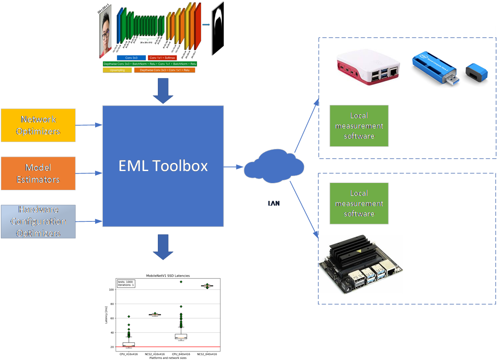
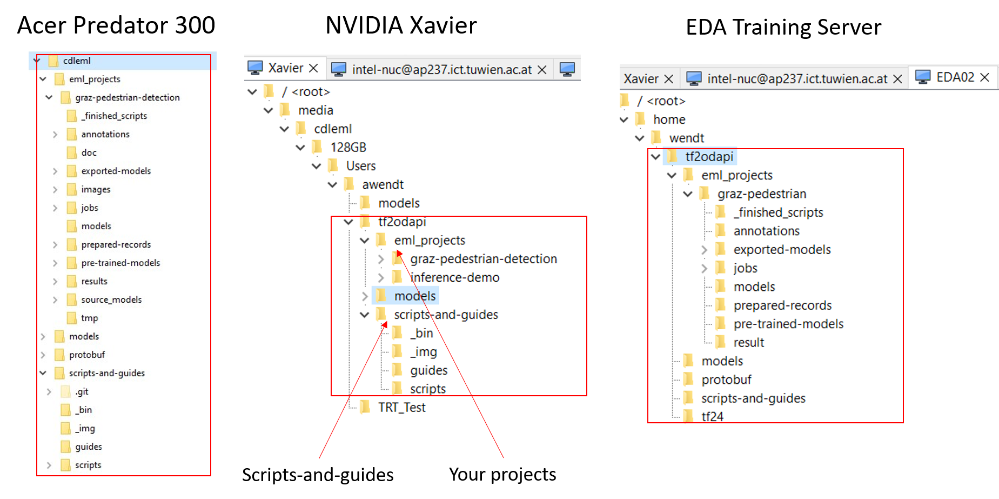
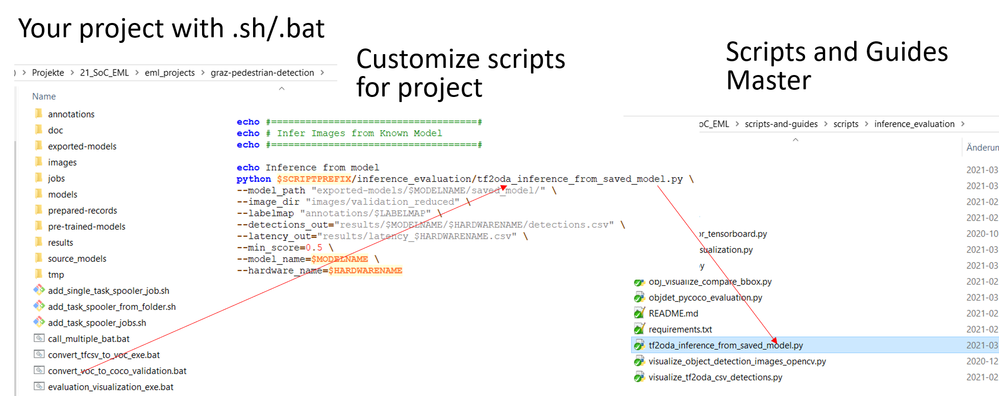
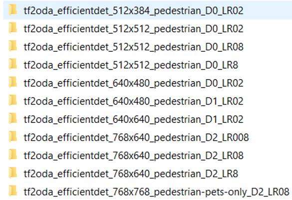

# Embedded Machine Learning Toolbox

The EML Toolbox is a collection of scripts by the <a href="https://embedded-machine-learning.github.io/webpage/">Christian Doppler Laboratory for Embedded Machine Learning</a> 
for automated and simplified training and inference of neural networks. We collect and unify scripts that help us in our everyday work to setup software and frameworks.

The purpose of using unified scripts on different hardware platforms is to solve the following task: Considering requirements regarding latency, accuracy and environmental factors,
we want to find the best combination of a 
- Neural network
- Neural network optimization
- Hardware 
- Hardware configuration

Secondary, we want to estimate or measure the effect of a particular network on multiple hardware to see where it works well.

## Overview
The EML Toolbox provides efficient cross-hardware measurements. 

Examples:
- Xavier running 3 days with 250 task spooler jobs for 33 networks
- Perform inference on multiple devices in parallel

## Architecture

The architecture conists of several parts:
- Toolbox: It provides the infrastructure through general python scripts for data preparation, training, inference and evaluation. Further, it provides common interfaces 
for the hardware inference engines and model optimizers. The interfaces are then utilized by execution scripts. 
- Network optimizers: Plug-in Pruning- and Quantization Tools that can be applied to a network to optimize its performance for a certain hardware device
- Network estimators: In a network search, estimators provide a possibility to test a certain hardware without having to implement the network on it. It saves engineering effort and
makes the process faster
- Hardware: The embedded hardware devices, which are connected to the toolbox and available for network tests
- Hardware configuration optimizers: For each hardware, there is the possibility to setup the hardware for minimum latency, minimum power or minimum energy consumption 

  

## Implementation
The EML Toolbox is built around uniformity. 

### Folder Structure
First, we use a uniform folder structure. The folders has the following structure, starting from some base folder, .e.g $HOME:
- ./eml_projects 		#Project folder for custom projects)
	- [YOUR PROJECT1]
	- [YOUR PROJECT2]
- ./scripts-and-guides 	#Scripts and guides repository
- ./models 				#Tesnorflow Object Detection API reporsitory, however optional
- ./protobuf 			#Protobuf as part of the Tensorflow Object Detection API
- ./tf24 				#Tensorflow 2.4 python virtual environment

The same structure is used for training as well as inference.

Each individial project uses the common folder structure from [Template Folder Structure for Tensor Flow](./template_workspace), which is similar to the standard Tensorflow 2 
workspace. 

  

### Execution Scripts
Within the common folder structure, we use an uniform execution of scripts. In the ./scripts-and-guides repository, there are two types of scripts: generalized python scripts
and specialized .bat and .sh scripts. The python scripts are used equally on each hardware. The shell scripts are adapted to a certain hardware or application of the python scripts.
The following types of scripts that form the toolbox core can be found here:

EML Toolbox Scripts: 
* [ Converters](./conversion): Data conversion scripts from e.g. VOC->Coco
* [ Data Processing Tools](./data_preparation): Renaming tools, partitioning of images into train-validation-test sets
* [ Hardware Modules](./hardwaremodules): Inference scripts for each hardware
	* [ eda_server](./hardwaremodules/eda_server): Training scripts for the EDA Servers or other servers
	* [ NVIDIA Trt](./hardwaremodules/nvidia): Specific inference and model conversion scripts for the NVIDIA platform
	* [ Intel OpenVino](./hardwaremodules/openvino): Specific inference and model conversion scripts for the Intel platform
	* [ Hardware Module Interfaces](./hardwaremodules/interfaces): Interface definitions for the hardware to be able to connect to the EML Toolbox
* [ Inference Evaluation Tools](./inference_evaluation): General inference and model evaluation tools, e.g. TF2 inference engine
* [ Power Measurements](./power_measurements): Power measurement scripts
* [ Training Tools](./training): Tools for the use to train models on a server
* [ Visualization](./visualization): Visualization tools adapted to the interfaces for the EML Toolbox
* [ Template Folder Structure for Tensor Flow](./template_workspace): TF2 Template folder structure

Additional Toolbox Extras:
* [ Sample Projects](https://github.com/embedded-machine-learning/scripts-and-guides-samples): To learn and debug the toolbox, sample projects are provided.

  

### Network File Names
Much information is put into the filename of a certain network. Many evaluation tools use this information from the position in the file name. Therefore, it is important to
keep on to this conventions, in order to prevent cusomization of tools.

Network file name convention:
[FRAMEWORK]_[NETWORKNAME]_[RESOLUTION_X]x[RESOLUTION_Y]_[DATASET]_[CUSTOM_PARAMETER_1]_[CUSTOM_PARAMETER_2]..._[CUSTOM_PARAMETER_n]

[FRAMEWORK]: 
- cf: Caffe
- tf2: Tensorflow 2
- tf2oda: Tensorflow 2 Object Detection API 
- dk: Darknet
- pt: PyTorch

If no dataset is known, the following syntax is used.
[DATASET] unknown: "ND"

Examples:
- tf2_mobilenetV2_224x224_coco_D100
- pt_refinedet_480x360_imagenet_LR03_WR04
- tf2oda_ssdmobilenetv2_320x320_pedestrian

  

### Hardware Module Interfaces
For the connection of platform specific inference engines and model optimizers, we use the following hardware module interfaces: [Hardware Module Interfaces](./hardwaremodules/interfaces)

### Supported Hardware
At the current state, the EML toolbox supports the following hardware platforms:
- NVIDIA Xavier
- Intel NUC

It support the following networks:
- Tensorflow 2 Object Detection API SSD-MobileNet
- Tensorflow 2 Object Detection API EfficientDet

## Guides how to use the Toolbox

### Setup Folder Structure for Training

### Setup Folder Structure for Inference

### Execute Inference on Intel Hardware

### Execute Inference on NVIDIA Hardware

## Upcoming

### Hardware Platforms
- Edge TPU USB Stick

### Networks
- YoloV4

#### Usage of the Scripts Repository
- Create a folder for this setup.
- Clone the scripts and guides repository into that folder, i.e. \[basefolder\]/scripts-and-guides
- Create a folder projects i.e. \[basefolder\]/projects
- Create your on project from the templates in scripts-and-guides in the projects folder like \[basefolder\]/projects/my_eml_project
- Copy all necessary scripts into the my_eml_project folder and adjust the paths. 

  

