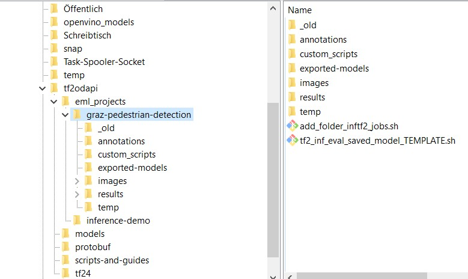

# Embedded Machine Learning Toolbox

The EML Toolbox is a collection of scripts by the <a href="https://embedded-machine-learning.github.io/webpage/">Christian Doppler Laboratory for Embedded Machine Learning</a> 
for automated and simplified training and inference of neural networks. We collect and unify scripts that help us in our everyday work to setup software and frameworks.

The purpose of using unified scripts on different hardware platforms is to solve the following task: Considering requirements regarding latency, accuracy and environmental factors,
we want to find the best combination of a 
- Neural network
- Neural network optimization
- Hardware 
- Hardware configuration

Secondary, we want to estimate or measure the effect of a particular network on multiple hardware to see where it works well.

## Overview
The EML Toolbox provides efficient cross-hardware measurements. 

Examples:
- Xavier running 3 days with 250 task spooler jobs for 33 networks
- Perform inference on multiple devices in parallel

## Architecture

The architecture conists of several parts:
- Toolbox: It provides the infrastructure through general python scripts for data preparation, training, inference and evaluation. Further, it provides common interfaces 
for the hardware inference engines and model optimizers. The interfaces are then utilized by execution scripts. 
- Network optimizers: Plug-in Pruning- and Quantization Tools that can be applied to a network to optimize its performance for a certain hardware device
- Network estimators: In a network search, estimators provide a possibility to test a certain hardware without having to implement the network on it. It saves engineering effort and
makes the process faster
- Hardware: The embedded hardware devices, which are connected to the toolbox and available for network tests
- Hardware configuration optimizers: For each hardware, there is the possibility to setup the hardware for minimum latency, minimum power or minimum energy consumption 

  

## Implementation and Interfaces
The EML Toolbox is built around uniformity and common interfaces to minimize the need for customization.

### Interface Folder Structure
We use a uniform folder structure. The advantage is that we can copy prepared scripts into this folder structure and execute without changing anything in the scripts. It reduces the engineering effort of setting up new projects. The folders has the following structure, starting from some base folder, .e.g $HOME:
- ./datasets				# Folder with datasets
- ./demonstration_projects	# Projects with complete scripts and data, which are used to test the environments
	- ./eml_projects/[YOUR DEMO]
- ./eml_projects 			# Project folder for custom projects)
	- ./eml_projects/[YOUR PROJECT1]
	- ./eml_projects/[YOUR PROJECT2]
- ./scripts-and-guides 		# Scripts and guides repository
- ./scripts-and-guides-samples 		# Scripts and guides repository with sample projects
- ./models 					# Tensorflow Object Detection API reporsitory, however optional
- ./protobuf 				# Protobuf as part of the Tensorflow Object Detection API
- ./envs					# Python environments (Note 20210719: new, optional interface addition to handle multiple environments)
	- ./envs/tf24			# Tensorflow 2.4 python virtual environment
	- ./envs/[YOUR ENVIRONMENT]

The same structure is used for training as well as inference.

Each individial project uses the common folder structure from [Template Folder Structure for Tensor Flow](https://github.com/embedded-machine-learning/interface_descriptions/tree/main/template_folders), which is similar to the standard Tensorflow 2 
workspace. 

  

### Interface Network Folder and File Names
Much information is put into the folder name of a certain network. Many evaluation tools use this information from the position in the file name. Therefore, it is important to
keep on to this conventions, in order to prevent customization of tools. The following naming convention is based on the structure of Tensorflow 2. 

Each model shall be put into a separate folder. Model file names shall be kept the same, e.g. saved_model.pb, while the folder name helds information about the network.

Network folder name convention:
[FRAMEWORK]_[NETWORKNAME]_[RESOLUTION_X]x[RESOLUTION_Y]_[DATASET]_[CUSTOM_PARAMETER_1]_[CUSTOM_PARAMETER_2]..._[CUSTOM_PARAMETER_n]

[FRAMEWORK]: 
- cf: Caffe
- tf2: Tensorflow 2
- tf2oda: Tensorflow 2 Object Detection API 
- dk: Darknet
- pt: PyTorch
- tf2ke: Tensorflow 2 Keras

If no dataset is known, the following syntax is used.
[DATASET] unknown: "ND"

Examples:
- tf2_mobilenetV2_224x224_coco_D100
- pt_refinedet_480x360_imagenet_LR03_WR04
- tf2oda_ssdmobilenetv2_320x320_pedestrian

  

### Interface Hardware Modules for Inference
For the connection of platform specific inference engines and model optimizers, we use the following hardware module interfaces: [Hardware Module Interfaces](./hardwaremodules/interfaces)

### Execution Scripts
Within the common folder structure, we use an uniform execution of scripts. In the ./scripts-and-guides repository, there are two types of scripts: generalized python scripts
and specialized .bat and .sh scripts. The python scripts are used equally on each hardware. The shell scripts are adapted to a certain hardware or application of the python scripts.
The following types of scripts that form the toolbox core can be found here:

EML Toolbox Scripts: 
* [ Converters](./conversion): Data conversion scripts from e.g. VOC->Coco
* [ Data Processing Tools](./data_preparation): Renaming tools, partitioning of images into train-validation-test sets
* [ Hardware Modules](./hardwaremodules): Inference scripts for each hardware
	* [ eda_server](./hardwaremodules/eda_server): Training scripts for the EDA Servers or other servers
	* [ NVIDIA Trt](./hardwaremodules/nvidia): Specific inference and model conversion scripts for the NVIDIA platform
	* [ Intel OpenVino](./hardwaremodules/openvino): Specific inference and model conversion scripts for the Intel platform
	* [ Hardware Module Interfaces](./hardwaremodules/interfaces): Interface definitions for the hardware to be able to connect to the EML Toolbox
* [ Inference Evaluation Tools](./inference_evaluation): General inference and model evaluation tools, e.g. TF2 inference engine
* [ Power Measurements](./power_measurements): Power measurement scripts
* [ Training Tools](./training): Tools for the use to train models on a server
* [ Visualization](./visualization): Visualization tools adapted to the interfaces for the EML Toolbox
* [ Template Folder Structure for Tensor Flow](./template_workspace): TF2 Template folder structure

Additional Toolbox Extras:
* [ Sample Projects](https://github.com/embedded-machine-learning/scripts-and-guides-samples): To learn and debug the toolbox, sample projects are provided.

  

### Supported Hardware
At the current state, the EML toolbox supports the following network - hardware platform - hardware optimization combinations:
- Tensorflow 2 Object Detection API SSD-MobileNet | NVIDIA Xavier | Tensorflow 2
- Tensorflow 2 Object Detection API EfficientDet | NVIDIA Xavier | Tensorflow 2
- Tensorflow 2 Object Detection API SSD-MobileNet | Intel NUC | OpenVino
- Tensorflow 2 Object Detection API SSD-MobileNet | Intel NCS2 | OpenVino
- Tensorflow 2 Object Detection API | Intel NUC | Tensorflow 2

## Guides how to use the Toolbox
The following guides will help the user to setup and execute the EML Toolbox.

In the following video [Videolink](https://vimeo.com/543560900), the tutorial guides the user on how to setup a standard workspace with a standard example (Oxford Pets) on 
Tensorflow 2 Object Detection API. First, the folder structure is setup. Then the images are copied. We then prepare the images for training with scripts in the 
EML toolbox followed by training on the server. Then, we test the model on a local PC and evaluate the results. 

### Setup Folder Structure for Inference
On a new hardware on Linux, we setup a workspace in the following way. The following instructions were executed on an Intel NUC.
1. Setup up a task spooler on the device to be able to execute multiple inferences in a queue.
2. In a folder, e.g. the home folder, copy the [installation script](./training/sh/install_tf2odapi.sh) and execute it `. install_tf2odapi.sh`. 
It will automatically create the folder structure described above, install all dependencies and test TF2 object detection api.
3. Copy the following files to the home folder and adapt the paths in the scripts to the locations on the device
- [init_eda_env.sh](hardwaremodules/openvino/sh/init_eda_env.sh)	#Environment setup, python environment
- [init_eda_ts.sh](hardwaremodules/openvino/sh/init_eda_ts.sh.sh)	#Task spooler setup
- [init_eda_ts_env.sh](hardwaremodules/openvino/sh/init_eda_ts_env.sh)	#Starts the previous scripts with one command
4. From your project `./YOUR_PROJECT`, copy the following folder as and files to the target platform:
- ./annotations			# Ground truth annotions for the validation images
- ./exported-models		# Exported TF2ODA models from training. 
- ./images/validation	#Validation images for performance measurement. Usually, a correpsonding annotionation file has to be prepared
- [add_folder_inftf2_jobs.sh](./hardwaremodules/openvino/sh/add_folder_inftf2_jobs.sh)		#Starts the task spooler
- [tf2_inf_eval_saved_model_TEMPLATE.sh](./hardwaremodules/openvino/sh/tf2_inf_eval_saved_model_TEMPLATE.sh)

The complete folder structure should look like this:

  

### Execute Inference on Intel Hardware
If everything is setup correctly and there are exported models in `./exported-models`, check if paths are correct in the scripts and execute
`./add_folder_inftf2_jobs.sh`. The script will do the following:
1. Read the model names from `./exported-models`
2. For each model name, it will create a copy of `./tf2_inf_eval_saved_model_TEMPLATE.sh` and replace TEMPLATE with the model name.
3. Add the copied and renamed script to the task spooler
4. As the task starts, inference will be done on the model that is part of the file name.
5. Results will be written into `./results` with a folder for each model and hardware as well as result files according to [Hardware Module Interfaces](./hardwaremodules/interfaces)

## Requirements for Connected Projects
The following requirements shall be implemented to be compatible to the EML Tool. If you are new to this topic, it is recommended to follow this process:
1. Setup the target system exactly as described in a reliable guide with their example networks
2. As soon as inference is possible with the standard method, then try to adapt the folder structure and the execution scripts 

**EML-IF 1:** The training project shall be setup with a virtual environment (venv) on EDA02 for training with at least demo data. A training demo or the real project shall be 
able to be executed without any changes of the start script. 

**EML-IF 2:** The following folder structure shall be used for the training and inference project unless customization is necessary:
[https://github.com/embedded-machine-learning/scripts-and-guides/tree/main/scripts/template_workspace](https://github.com/embedded-machine-learning/scripts-and-guides/tree/main/scripts/template_workspace)

**EML-IF 3:** Training and optimization scripts shall have the following structure:
[https://github.com/embedded-machine-learning/scripts-and-guides/blob/main/scripts/training/README.md#training-files-structure](https://github.com/embedded-machine-learning/scripts-and-guides/blob/main/scripts/training/README.md#training-files-structure)

**EML-IF 4:** Exported models after training shall use the following naming convention: 
[https://github.com/embedded-machine-learning/scripts-and-guides/blob/main/scripts/README.md#interface-network-folder-and-file-names](https://github.com/embedded-machine-learning/scripts-and-guides/blob/main/scripts/README.md#interface-network-folder-and-file-names)

**EML-IF 5:** The inference project shall be setup on at least one inference device with demo or real validation data. The project shall be 
able to be executed without any changes of the start script. 

**EML-IF 6:** All networks shall implement the following interface for latency measurements:
[https://github.com/embedded-machine-learning/scripts-and-guides/tree/main/scripts/hardwaremodules/interfaces#Interface-for-Hardware-Module-Developers](https://github.com/embedded-machine-learning/scripts-and-guides/tree/main/scripts/hardwaremodules/interfaces#Interface-for-Hardware-Module-Developers)

**EML-IF 7:** If applicable, All networks shall implement the following interface for object detection measurements:
[https://github.com/embedded-machine-learning/scripts-and-guides/tree/main/scripts/hardwaremodules/interfaces#Object-Detection-Interface](https://github.com/embedded-machine-learning/scripts-and-guides/tree/main/scripts/hardwaremodules/interfaces#Object-Detection-Interface)

## Upcoming

### Hardware Platforms
- Edge TPU USB Stick

### Networks
- YoloV4

#### Usage of the Scripts Repository
- Create a folder for this setup.
- Clone the scripts and guides repository into that folder, i.e. \[basefolder\]/scripts-and-guides
- Create a folder projects i.e. \[basefolder\]/projects
- Create your on project from the templates in scripts-and-guides in the projects folder like \[basefolder\]/projects/my_eml_project
- Copy all necessary scripts into the my_eml_project folder and adjust the paths. 

  

