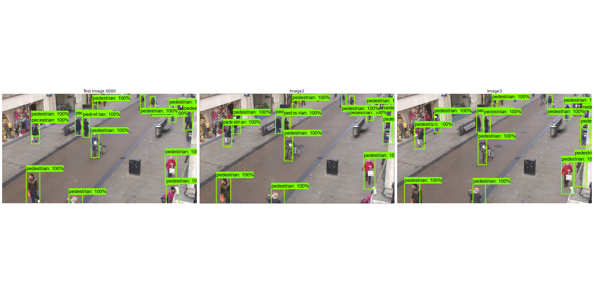

# Evaluation Tools

The evaluation tools contain useful tools for evaluating the performance of inference. As the scripts were usually not written from scratch, but copied 
and modified from other sources, the licence information of the other sources is kept within the script.

## Tools
For the tool scripts, the following constants are defined. 
```
:: Constants Definition
set USEREMAIL=alexander.wendt@tuwien.ac.at
set MODELNAME=ssd_mobilenet_v2_R300x300_D100_coco17_pets
set MODELNAMESHORT=MobNetV2_300x300_D100
set HARDWARENAME=CPU_Intel_i5
set PYTHONENV=tf24
::set SCRIPTPREFIX=..\..\scripts-and-guides\scripts
set SCRIPTPREFIX=..\..\..
set LABELMAP=pets_label_map.pbtxt

:: Environment preparation
echo Activate environment %PYTHONENV%
call conda activate %PYTHONENV%
```

### Visualize Bounding Boxes with TensorFlow 2
File: obj_visualize_compare_bbox.py
Usage: Select two or three images with their bounding boxes in PASCAL VOC XML format and visualize then within one image.
Example as Windows batch script: 
```
python obj_visualize_compare_bbox.py --labelmap="samples/annotations/label_map.pbtxt" ^
--output_dir="samples/results" ^
--image_path1="samples/images/0.jpg" --annotation_dir1="samples/annotations/xml" --title1="Image 1" ^
--image_path2="samples/images/10.jpg" --annotation_dir2="samples/annotations/xml" --title2="Image 2" ^
--image_path3="samples/images/20.jpg" --annotation_dir3="samples/annotations/xml" --title3="Image 3" ^
--use_three_images
```

Result for comparing three different images.

<div align="center">
  
</div>

### Visualize Bounding Boxes with OpenCV
File: visualize_object_detection_images_opencv.py
Usage: Select two images with their bounding boxes in PASCAL VOC XML format and visualize then within one image.
It uses OpenCV for the visualization of the bounding boxes.
Example as Windows batch script: 
```
python visualize_object_detection_images_opencv.py ^
--image_path1="samples/images/0.jpg" --annotation_dir1="samples/annotations/xml" ^
--image_path2="samples/images/30.jpg" --annotation_dir2="samples/annotations/xml" ^
--output_dir="samples/results" ^
--line_thickness=2
```

### Perform Inference TensorFlow 2 Saved Model
Usage: Load an exported TF2 model from --model_path and perform inference on images in --image_dir. Use a labelmap --label_map. The results are saved in a csv of TF2
format with --detections_out. Define the min_score for the 100 boxes if you don't want to save everything. A latency evaluation is created --latency_out. For evaluation, provide
the full model name, a short model name for the graphs and the hardware.

Script: tf2oda_inference_from_saved_model.py

Source: 

Example as Windows batch script: 
```
:: Constants Definition
set USEREMAIL=alexander.wendt@tuwien.ac.at
set MODELNAME=ssd_mobilenet_v2_R300x300_D100_coco17_pets
set MODELNAMESHORT=MobNetV2_300x300_D100
set HARDWARENAME=CPU_Intel_i5
set PYTHONENV=tf24
::set SCRIPTPREFIX=..\..\scripts-and-guides\scripts
set SCRIPTPREFIX=..\..\..
set LABELMAP=pets_label_map.pbtxt

:: Environment preparation
echo Activate environment %PYTHONENV%
call conda activate %PYTHONENV%

echo #====================================#
echo #Infer new images
echo #====================================#

python %SCRIPTPREFIX%\inference_evaluation\tf2oda_inference_from_saved_model.py ^
--model_path="exported-models/%MODELNAME%/saved_model/" ^
--image_dir="images/validation" ^
--labelmap="annotations/%LABELMAP%" ^
--detections_out="results/%MODELNAME%/validation_for_inference/detections.csv" ^
--latency_out="results/latency.csv" ^
--min_score=0.5 ^
--model_name=%MODELNAME% ^
--model_short_name=%MODELNAMESHORT% ^
--hardware_name=%HARDWARENAME%
```

### Calculate Coco Metrics for Object Detection
Coco metrics decoupled from Tensorboard to perform evaluation on networks.

File: objdet_pycoco_evaluation.py

Usage: Create a ground truth file in Coco JSON format. Perform detections with a model and convert the detections into Coco JSON detection format. 
The result is saved or appended to the output file --output_file for further processing and visualization. To be able to sort the measurements, provide model_name 
and hardware_name.

Notice: in the grounf truth JSON file, add only the annotations for which images are available. Else, these annotations are considered although they are not tested and
it lowers the metric scores.

Example as Windows batch script: 
```
python %SCRIPTPREFIX%\inference_evaluation\objdet_pycoco_evaluation.py ^
--groundtruth_file="annotations/coco_pets_validation_annotations.json" ^
--detection_file="results/%MODELNAME%/validation_for_inference/coco_pets_detection_annotations.json" ^
--output_file="results/performance.csv" ^
--model_name="SSD-MobileNet" ^
--hardware_name="Intel_CPU_i5"
```

### Visualize Evaluations from Latency and Performance Collection Files
Usage: Provide

Script: evaluation_visualization.py

Source: 

Example as Windows batch script: 
```
python %SCRIPTPREFIX%\inference_evaluation\evaluation_visualization.py ^
--latency_file="results/latency.csv" ^
--performance_file="results/performance.csv" ^
--output_dir="results"
```


## Issues
Should any issues arise during the completion of the guide or any errors noted, please let us know by filing an issue and help us keep up the quality.

<div align="center">
  
</div>
